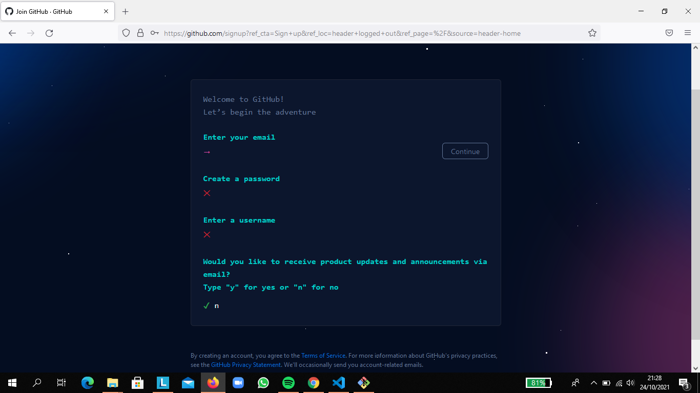
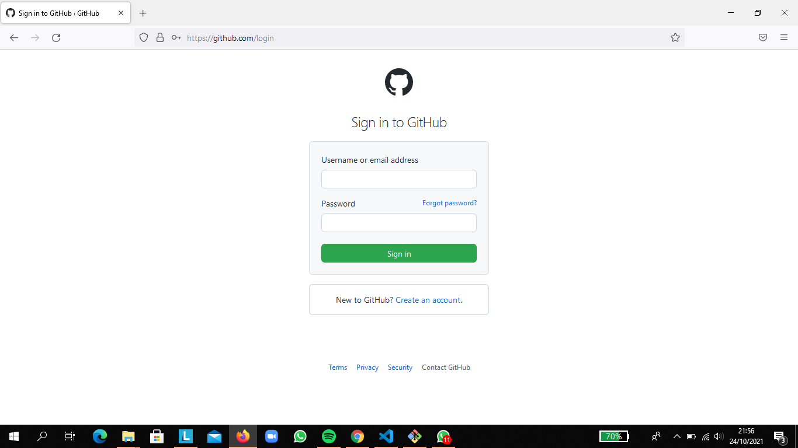
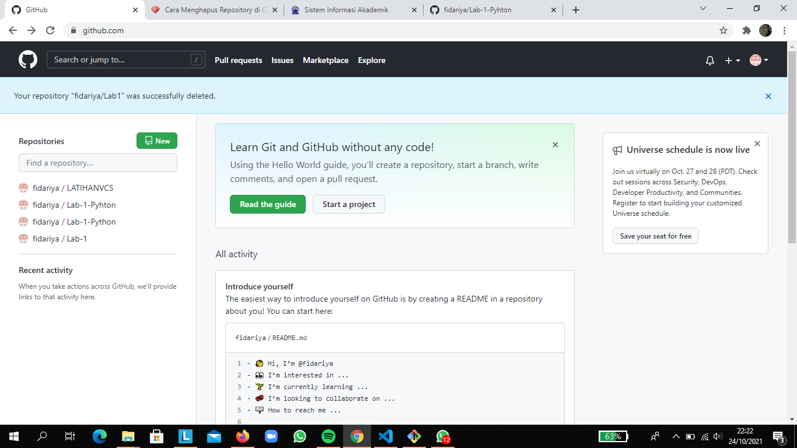
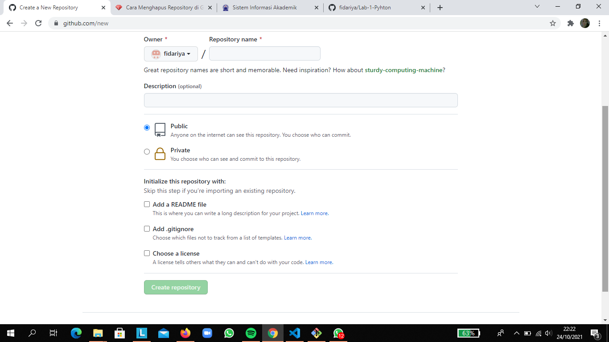
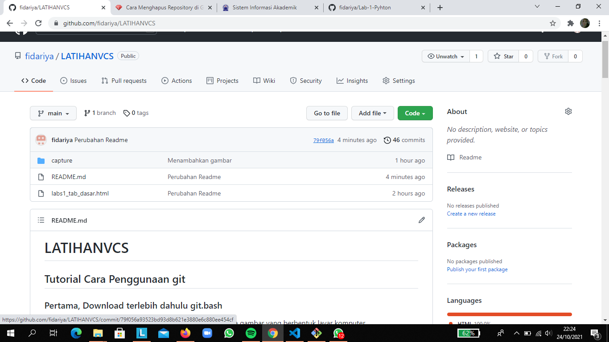
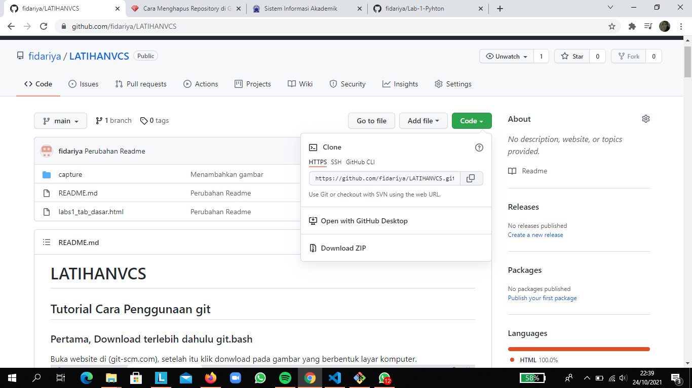

# LATIHANVCS
## Tutorial Cara Penggunaan git

### Pertama, Download terlebih dahulu git.bash
Buka website di (git-scm.com), setelah itu klik donwload pada gambar yang berbentuk layar komputer.  

### Kedua, Setelah terinstal langsung kita buka file download git.bash yang sudah kita instal.
Lalu kita klik next terus menurus sampai tampilannya seperti gambar dibawah ini. Jika tampilannya sudah seperti gambar dibawah ini git bash sudah bisa dipakai.                                                         

### Ketiga, Masuk akun github
Sebelum menghubungkan git hub dan git bash untuk membuat folder, kita harus mempunyai akun git hub terlebih dahulu. Jika belum mempunyai akun git hub harus daftar terlebih dahulu, unntuk proses pendaftaran dan menghubungkan pada git bash bisa dilihat dengan cara dibawah ini.                                                 
1. Masuk ke browser git hub dengan mengklik link github.com
2. Jika sudah masuk ke web github, maka tampilannya seperti ini lalu kita klik bagian yang dilingkari pada gambar dibawah ini.                                                 

3. Setelah mengklik sign up lalu ada tampilan seperti dibawah ini, lalu masukan gmail yang anda miliki dan masukan nama untuk akun github. Nanti akan ada kode verifikasi yang dikirim melalui gmail yang anda cantumkan pada saat pendaftaran akun github.                                      

4. Karna sudah daftar akun github, anda dapat langsung mengklik sig in pada website github. Maka tampilannya seperti ini lalu masukan email yang sudah terhubung dengan github.

5. Setelah anda berhasil login, maka anda dapat membuat file repository. Seperti gambar dibawah ini, lalu klik new.

6. Tampilan dibawah ini setelah anda mengklik new, lalu anda dapat mengisi nama repository dan pada gambar dibawah ini ada pilihan publik atau privat jika anda ingin mengklik publik anda dapat mengklik pilihan tersebut. Lalu klik pilihan add a readme file setelah itu klik create repository.

7. Ini merupakan tampilan jika anda sudah membuat repsitory.

8. Kita copy terlebih dahulu kode file repository seperti gambar dibawah ini yang ditunjukan oleh kursor.

### Pertama, tentukan file untuk penempatan file projcet github
### Kedua, memasukan kode clone
lakukan dengan memasukan code clone yang sudah dicopy pada github, seperti gambar dibawah ini:

### Ketiga, menambahkan file
Masukan perintah dengan menggunakan kode " git add " contoh, " git add Labs_tab_dasar.html"

### Keempat, untuk menyimpan perubahan tetapi tidak ada perubahan pada remote repository
Maka masukan perintah git commit -m "", pada tanda kutip tersebut berguna untuk memasukan nama project. Seperti pada gambar dibawah ini,                                                                               

### Kelima, git status
git status merupakan pengechekan pada status file yang kita buat.

### Keenam, git push
Memasukan kode " git push -u origin main "

### Hasil dari pengkodean yang sudah dilakukan pada github
