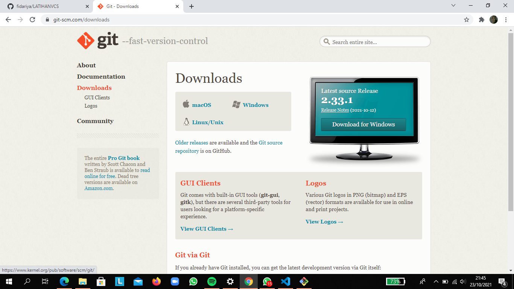
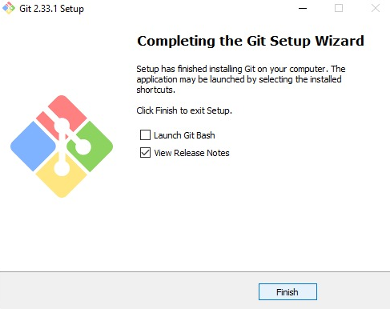
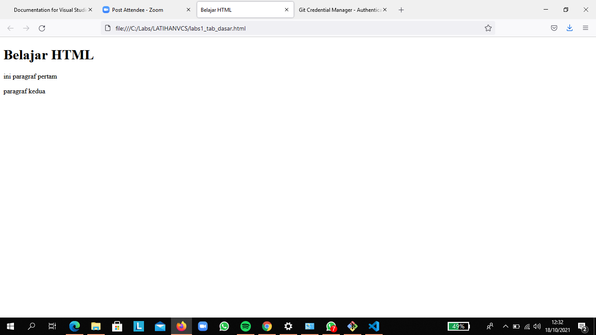
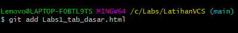
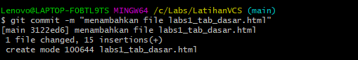
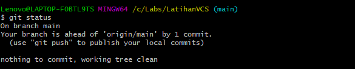
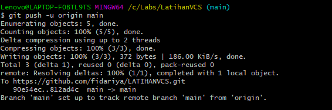
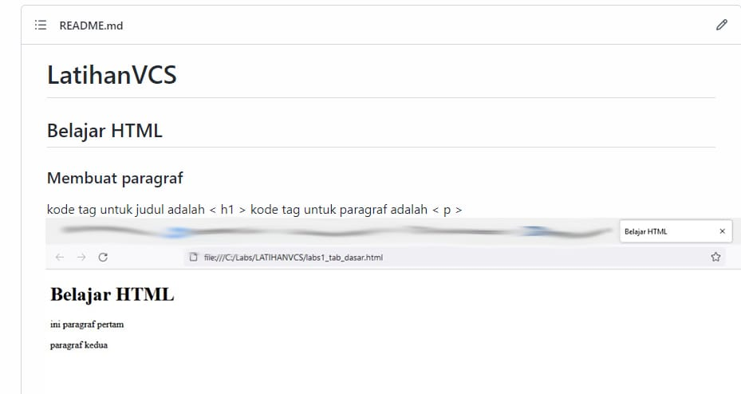

# LATIHANVCS
## Tutorial Cara Penggunaan git

### Pertama, Download terlebih dahulu git.bash
Buka website di (git-scm.com), setelah itu klik donwload pada gambar yang berbentuk layar komputer.  

### Kedua, Setelah terinstal langsung kita buka file download git.bash tadi
Dan tampilannya seperti gambar dibawah ini, lalu kita klik next terus menurus sampai tampilannya seperti gambar dibawah ini.                                                        

### Pertama, tentukan file untuk penempatan file projcet github
### Kedua, memasukan kode clone
lakukan dengan memasukan code clone yang sudah dicopy pada github, seperti gambar dibawah ini:

### Ketiga, menambahkan file
Masukan perintah dengan menggunakan kode " git add " contoh, " git add Labs_tab_dasar.html"

### Keempat, untuk menyimpan perubahan tetapi tidak ada perubahan pada remote repository
Maka masukan perintah git commit -m "", pada tanda kutip tersebut berguna untuk memasukan nama project. Seperti pada gambar dibawah ini,                                                                               

### Kelima, git status
git status merupakan pengechekan pada status file yang kita buat.

### Keenam, git push
Memasukan kode " git push -u origin main "

### Hasil dari pengkodean yang sudah dilakukan pada github
