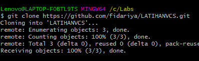

# LATIHANVCS
## Tutorial Cara Penggunaan git

### Pertama, tentukan file untuk penempatan file projcet github
### Kedua, memasukan kode clone
lakukan dengan memasukan code clone yang sudah dicopy pada github, seperti gambar dibawah ini:

### Ketiga, menambahkan file
Masukan perintah dengan menggunakan kode " git add " contoh, " git add Labs_tab_dasar.html"
